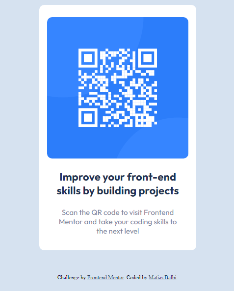

# Frontend Mentor - QR code component solution

This is a solution to the [QR code component challenge on Frontend Mentor](https://www.frontendmentor.io/challenges/qr-code-component-iux_sIO_H). Frontend Mentor challenges help you improve your coding skills by building realistic projects.

## Table of contents

- [Overview](#overview)
  - [Screenshot](#screenshot)
  - [Links](#links)
- [My process](#my-process)
  - [Built with](#built-with)
  - [What I learned](#what-i-learned)
- [Author](#author)

## Overview

This is a small project of a frontendmentor.io challenge that consists of creating a card with a qr image.

### Screenshot



### Links

- Solution URL: [Frontend Mentor](https://www.frontendmentor.io/challenges/qr-code-component-iux_sIO_H/hub/pagina-responsiva-de-cdigo-qr-con-css-ix9YbJ6Kfg)
- Live Site URL: [Netlify qr-code-mb](https://qr-code-mb.netlify.app/)

## My process

The process of creating this project had as a kick to start creating the html skeleton with the elements that we were going to use and then give it the necessary styles so that the result is as expected.

### Built with

- Semantic HTML5 markup
- CSS custom properties
- Flexbox
- Mobile-first workflow

### What I learned

I was able to learn how to center elements. I also learned how to give a minimum height value to an element.

```css
.main-container {
  display: block;
  width: 320px;
  min-height: 500px;
  background-color: hsl(0, 0%, 100%);
  border-radius: 10px;
  margin: 32px 28px 49px 28px;
}
```

## Author

- Frontend Mentor - [@MatiBalbiDev](https://www.frontendmentor.io/profile/MatiBalbiDev)
- Twitter - [@MatiasDev314](https://twitter.com/MatiasDev314)
